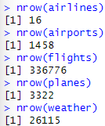
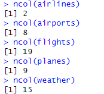
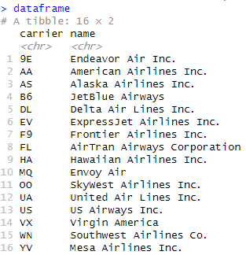
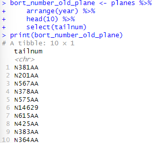
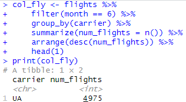

## Цель работы
1. Закрепить практические навыки использования языка программирования R для обработки данных.
2. Закрепить знания основных функций обработки данных экосистемы tidyverse языка R.
3. Развить практические навыки использования функций обработки данных пакета dplyr – функции
select(), filter(), mutate(), arrange(), group_by().

## Исходные данные
1. RStudio.

## План
1. Установить пакет nycflights13.
2. Выполнить задание.
3. Оформить отчет.

## Описание шагов
Устанавливаем библиотеку nycflights13.

```
install.packages("nycflights13")
```
Загружаем пакет nycflights13 и dplyr.

```
library(nycflights13)
library(dplyr)
```

- Задание 1. . Сколько встроенных в пакет nycflights13 датафреймов?

```
data(package = "nycflights13")
```


- Задание 2. Сколько строк в каждом датафрейме?

Первый способ:
```
nrow(airlines)
nrow(airports)
nrow(flights)
nrow(planes)
nrow(weather)
```



Второй способ:
```
data_list <- list(airlines, airports, flights, planes, weather)
row_data <- sapply(data_list, nrow)
cat(row_data)
```
Мы формируем список data_list, включающий пять различных наборов данных (airlines, airports, flights, planes, weather). Затем мы применяем функцию sapply к этому списку, чтобы вычислить количество строк в каждом датафрейме. Результатом является вектор row_data, содержащий количество строк в каждом датафрейме, и мы выводим его на экран.


- Задание 3. Сколько столбцов в каждом датафрейме?

Первый способ:

```
ncol(airlines)
ncol(airports)
ncol(flights)
ncol(planes)
ncol(weather)
```



Второй способ:

```
data_list2 <- list(airlines, airports, flights, planes, weather)
col_data <- sapply(data_list2, ncol)
cat(col_data)
```

Мы формируем список data_list2, включающий пять различных наборов данных (airlines, airports, flights, planes, weather). Затем мы применяем функцию sapply к этому списку, чтобы вычислить количество строк в каждом датафрейме. Результатом является вектор col_data, содержащий количество строк в каждом датафрейме, и мы выводим его на экран.


- Задание 4. Как просмотреть примерный вид датафрейма?

```
dataframe <- airlines %>% glimpse()
dataframe
dataframe2 <- airports %>% glimpse()
dataframe2
dataframe3 <- flights %>% glimpse()
dataframe3
dataframe4 <- planes %>% glimpse()
dataframe4
dataframe5 <- weather %>% glimpse()
dataframe5
```

Мы используем функцию glimpse() для присваивания переменным dataframe, dataframe2, dataframe3, dataframe4 и dataframe5 результатов работы функции. Функция glimpse() показывает краткую информацию о структуре каждого датафрейма, включая количество строк, столбцов и типы данных в каждом столбце. Затем мы выводим результат на экран.




- Задание 5. Сколько компаний-перевозчиков (carrier) учитывают эти наборы данных (представлено в наборах данных)?

```
carriers <- airlines %>%
  select(carrier) %>%
  distinct() %>%
  nrow()
cat(carriers)
```

Мы используем функции select(carrier), distinct() и nrow() для присваивания переменной carriers результатов их работы.

Функция select(carrier) выбирает только столбец с названием "carrier" из исходных данных.

Затем функция distinct() удаляет дубликаты значений в выбранном столбце "carrier".

И, наконец, функция nrow() возвращает количество строк в полученном результате.

Мы выводим полученный результат на экран.


- Задание 6. Сколько рейсов принял аэропорт John F Kennedy Intl в мае?

```
flights_JFK <- flights %>%
  filter(month == 5 & dest == "JFK") %>%
  nrow()
cat(flights_JFK)
```

Мы применяем функции filter(month == 5 & dest == "JFK") и nrow() для присваивания переменной flights_JFK результатов работы этих функций.

Функция filter(month == 5 & dest == "JFK") выбирает только те строки, где значение столбца "month" равно 5 и значение столбца "dest" равно "JFK".

Затем функция nrow() используется для подсчета количества строк в наборе данных, которые удовлетворяют условиям фильтрации.

Мы выводим полученный результат на экран.


- Задание 7. Какой самый северный аэропорт?

```
N_airports <- airports %>%
  arrange(desc(lat)) %>%
  head(1)
cat(N_airports$name)
```

Мы используем функции arrange(desc(lat)) и head(1) для присваивания переменной N_airports результата их работы.

Функция arrange(desc(lat)) сортирует строки в порядке убывания значения столбца "lat" (широта).

Затем функция head(1) возвращает первую строку из отсортированного набора данных, то есть аэропорт с наибольшим значением широты.

Мы выводим полученный результат на экран.


- Задание 8. Какой аэропорт самый высокогорный (находится выше всех над уровнем моря)?

```
alpine_airport <- airports %>%
  arrange(desc(alt)) %>%
  head(1)
cat(alpine_airport$name)
```

Мы используем функции arrange(desc(alt)) и head(1) для присваивания переменной alpine_airport результата их работы.

Функция arrange(desc(alt)) сортирует строки в порядке убывания значения столбца "alt" (высота над уровнем моря).

Затем функция head(1) возвращает первую строку из отсортированного набора данных, то есть аэропорт с наибольшим значением высоты над уровнем моря.

Мы выводим полученный результат на экран.


- Задание 9. Какие бортовые номера у самых старых самолетов?

```
bort_number_old_plane <- planes %>%
  arrange(year) %>%
  head(10) %>%
  select(tailnum)
bort_number_old_plane
```
Мы используем функции arrange(year), head(10), и select(tailnum) для присваивания переменной bort_number_old_plane результата их работы.

Функция arrange(year) сортирует строки в порядке возрастания значения столбца "year" (год выпуска самолета).

Затем функция head(10) возвращает первые 10 строк из отсортированного набора данных, то есть 10 самых старых самолетов.

Затем функция select(tailnum) выбирает только столбец "tailnum" (бортовой номер) из полученного набора данных.

Мы выводим полученный результат на экран.



- Задание 10. Какая средняя температура воздуха была в сентябре в аэропорту John F Kennedy Intl (в градусах Цельсия).

```
temp_sep <- weather %>%
  filter(month == 9 & origin == "JFK") %>%
  summarise(avg_temp = mean(temp, na.rm = TRUE))
grad_C <- (5/9) * (temp_sep$avg_temp - 32)
cat(grad_C)
```

Мы используем функции filter(month == 9 & origin == "JFK"), summarise(avg_temp = mean(temp, na.rm = TRUE)) и присваиваем результат их работы переменной temp_sep.

Функция filter(month == 9 & origin == "JFK") выбирает только те строки, где значение столбца "month" равно 9 и значение столбца "origin" равно "JFK" (аэропорт JFK).

Затем функция summarise(avg_temp = mean(temp, na.rm = TRUE)) вычисляет среднее значение столбца "temp" для выбранных строк и результат сохраняется в столбце "avg_temp".

Мы присваиваем переменной grad_c значение в градусах Цельсия, вычисленное по формуле (5/9) * (temp_sep$avg_temp - 32), где temp_sep$avg_temp - среднее значение температуры, вычисленное на предыдущем этапе.

Мы выводим полученный результат на экран.


- Задание 11. Самолеты какой авиакомпании совершили больше всего вылетов в июне?

```
col_fly <- flights %>% 
  filter(month == 6) %>% 
  group_by(carrier) %>% 
  summarize(num_flights = n()) %>% 
  arrange(desc(num_flights)) %>% 
  head(1)
col_fly
```

Мы используем функции filter(month == 6), group_by(carrier), summarize(num_flights = n()) и arrange(desc(num_flights)) для присваивания переменной col_fly результата их работы.

Функция filter(month == 6) выбирает только те строки, где значение столбца "month" равно 6.

Затем функция group_by(carrier) группирует строки по значению столбца "carrier".

Затем функция summarize(num_flights = n()) вычисляет количество строк в каждой группе и результат сохраняется в столбце "num_flights".

Далее функция arrange(desc(num_flights)) сортирует строки в порядке убывания по значению столбца "num_flights".

Наконец, функция head(1) возвращает первую строку из отсортированного набора данных, то есть авиакомпанию с наибольшим количеством рейсов в июне.

Мы выводим полученный результат на экран.



- Задание 12. Самолеты какой авиакомпании задерживались чаще других в 2013 году?

```
flight_delays <- flights %>% 
  filter(year == 2013) %>% 
  group_by(carrier) %>% 
  summarize(num_delays = sum(arr_delay > 0, na.rm = TRUE)) %>% 
  arrange(desc(num_delays)) %>% 
  head(1)
flight_delays
```

Мы используем функции filter(year == 2013), group_by(carrier), summarize(num_delays = sum(arr_delay > 0, na.rm = TRUE)) и arrange(desc(num_delays)) для присваивания переменной flight_delays результата их работы.

Функция filter(year == 2013) выбирает только те строки, где значение столбца "year" равно 2013.

Затем функция group_by(carrier) группирует строки по значению столбца "carrier".

Далее функция summarize(num_delays = sum(arr_delay > 0, na.rm = TRUE)) вычисляет количество строк в каждой группе, где значение столбца "arr_delay" больше 0. Это позволяет определить количество задержек прибытия рейсов для каждой авиакомпании в 2013 году. Функция na.rm = TRUE используется для игнорирования пропущенных значений.

Затем функция arrange(desc(num_delays)) сортирует строки в порядке убывания по значению столбца "num_delays".

Наконец, функция head(1) возвращает первую строку из отсортированного набора данных, то есть авиакомпанию с наибольшим количеством задержек прибытия рейсов в 2013 году.

Мы выводим полученный результат на экран.


## Вывод
Я практиковал использование языка R для обработки данных, укрепил знания базовых типов данных в R и развил навыки использования функций обработки данных из пакетов dplyr и nycflights13.
